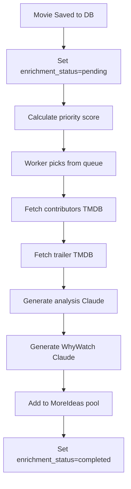

# Catalog Management Strategy

**Last Updated:** 2026-05-12
**Status:** Active Implementation - Coverage Measurement Active
**Priority:** CRITICAL - Site Survival

---

## Table of Contents

1. [The Problem](#the-problem)
2. [The Solution](#the-solution)
3. [UseOnce: Discovery Phase](#useonce-discovery-phase)
4. [Enrichment Pipeline: Completion Phase](#enrichment-pipeline-completion-phase)
5. [Current State](#current-state)
6. [Implementation Roadmap](#implementation-roadmap)
7. [Monitoring & Success Metrics](#monitoring--success-metrics)

---

## The Problem

**MovieGenius faces two interconnected survival threats:**

### 1. TMDB Rate Limiting (Immediate Risk)
- **Free tier limit:** 10,000 requests/day
- **Scale scenario:** 1,000 daily users × 10 pages/user = 40,000 TMDB calls/day
- **Result:** Rate limiting → Site breaks → Users get errors
- **If TMDB cuts us off, MovieGenius goes dark**

### 2. Incomplete Catalog (Quality Risk)
- **Total movies:** 32,953
- **Complete (all 8 features):** 9,977 (30.3%)
- **Incomplete:** 22,976 (69.7%)

**Feature coverage (8 core features):**
| Feature | Coverage | Missing | % |
|---------|----------|---------|---|
| Title | 100.0% | 0 | ✅ |
| Year | 100.0% | 0 | ✅ |
| Poster | 98.8% | 399 | ✅ |
| Slug | 93.8% | 2,059 | ⚠️ |
| MoreIdeas | 97.2% | 934 | ✅ |
| WhyWatch | 58.5% | 13,664 | 🔴 |
| Trailer | 45.6% | 17,933 | 🔴 |
| Contributors | 41.4% | 19,308 | 🔴 |

**Note:** MoreIdeas join issue was fixed on 2026-05-12 (32,019 records recovered)

**Impact on features:**
- **Search:** Returns mix of complete + incomplete results (inconsistent quality)
- **MoreIdeas:** ~~14% match failures~~ **FIXED** - 97.2% coverage after join repair (2026-05-12)
- **WhyWatch:** Missing for 41.5% of movies (flagship feature unavailable)
- **External recommendations:** 42% of recommended films (22,937 movies) not in catalog
  - 802 high-priority films (8+ recommendations) missing
- **User experience:** Empty/incomplete movie pages (unprofessional)

**Root cause:** Movies enter the system incomplete and stay incomplete indefinitely.

---

## The Solution

**Two complementary strategies working together:**

### Strategy 1: UseOnce (Discovery)
**Purpose:** Control TMDB usage by building our own database copy
**When:** User triggers (search, browse, direct link)
**Speed:** Immediate
**Scope:** Basic metadata (title, year, poster)

### Strategy 2: Enrichment Pipeline (Completion)
**Purpose:** Ensure every movie is 100% complete
**When:** After movie enters database
**Speed:** Background (minutes to hours)
**Scope:** Full data (cast, trailer, analysis, WhyWatch)

**Combined flow:**
```
User searches "Inception"
↓
[UseOnce Part 2] Check DB
↓
Not found → [UseOnce Part 1] Fetch from TMDB → Save basic metadata
↓
[Enrichment Trigger] Queue for completion
↓
Return search result (basic data available)

[Background Worker]
↓
Fetch contributors (TMDB)
↓
Fetch trailer (TMDB)
↓
Generate analysis (Claude)
↓
Generate WhyWatch (Claude)
↓
Mark complete

User clicks movie
↓
[UseOnce Part 2] Check DB (now complete!)
↓
Return full page
↓
No additional TMDB calls
```

---

## UseOnce: Discovery Phase

### The Two-Part Contract

**Part 1: Save what you fetch**
Every TMDB API call MUST persist the response data to our database.

```javascript
import { useOnce } from '../../lib/services/tmdb-persist';

const tmdbMovie = await fetchFromTMDB(id);
await useOnce(tmdbMovie); // Saves to DB + triggers enrichment
return tmdbMovie;
```

**Part 2: Check database first**
Before calling TMDB, check if we already have the data.

```javascript
// Check DB first
const dbMovie = await getMovieByTmdbId(id);
if (dbMovie) {
  return dbMovie; // Avoided TMDB call!
}

// Not in DB, fetch from TMDB (last resort)
const tmdbMovie = await fetchFromTMDB(id);
await useOnce(tmdbMovie); // Save for next time
return tmdbMovie;
```

### The Virtuous Cycle

**Month 1:**
- 100 users search → 100 TMDB calls → Save 2,000 movies to DB
- Coverage: 2,000 movies

**Month 2:**
- 200 users search → Hit DB 60% of time → Only 80 new TMDB calls
- Coverage: 3,500 movies

**Month 6:**
- 1,000 users → Hit DB 95% of time → Only 50 new TMDB calls/day
- Coverage: 15,000 movies
- **Under TMDB rate limit** ✅

**Without UseOnce:**
- 1,000 users → Every request hits TMDB → 40,000 calls/day
- **Rate limited, site broken** ❌

### Implementation Rules

**MANDATORY: Both Parts Required**

You cannot do Part 1 without Part 2:
- ❌ Save but never check DB → Wasted effort, still hit TMDB every time
- ❌ Check DB but never save → Always miss, DB stays empty

**Both parts are required** to create the protective buffer.

### Exception: Search Endpoints

**TMDB-first is acceptable for search** (their search quality is better)

```javascript
// For search, TMDB-first is OK, but MUST save results
const tmdbResults = await searchTMDB(query);

// Save everything (fire-and-forget, don't block response)
tmdbResults.forEach(movie => {
  useOnce(movie).catch(() => {}); // Saves for future
});

return tmdbResults;
```

**This still helps:** Next time someone loads one of those movie detail pages, it's already in the DB.

---

## Enrichment Pipeline: Completion Phase

### The Enrichment Lifecycle



### Priority System

```javascript
// On movie creation/discovery
async function setPriority(tmdb_id) {
  const tmdbData = await fetchTMDBMovie(tmdb_id);

  let priority = 0;

  // Popularity bonus (0-100)
  priority += Math.min(tmdbData.popularity || 0, 100);

  // Vote count bonus (0-50)
  priority += Math.min((tmdbData.vote_count || 0) / 100, 50);

  // Recency bonus (0-30)
  const yearsSinceRelease = new Date().getFullYear() - tmdbData.year;
  if (yearsSinceRelease < 2) priority += 30;
  else if (yearsSinceRelease < 5) priority += 20;
  else if (yearsSinceRelease < 10) priority += 10;

  // User-requested bonus (0-200)
  if (wasUserSearched(tmdb_id)) priority += 200;

  await db.query(
    'UPDATE movies SET enrichment_priority = $1 WHERE tmdb_id = $2',
    [priority, tmdb_id]
  );
}
```

**Priority tiers:**
- **Critical (200+):** User-searched movies (enrich immediately)
- **High (100-199):** Recent + popular (enrich within 24h)
- **Medium (50-99):** Moderately popular (enrich within 1 week)
- **Low (0-49):** Obscure (enrich when capacity available)

### Background Worker

```javascript
// worker/enrich-movies.js

async function enrichMovie(tmdb_id) {
  console.log(`[Enrich] Starting: ${tmdb_id}`);

  try {
    // 1. Fetch contributors (cast/crew)
    const contributors = await fetchTMDBCredits(tmdb_id);
    await db.query(
      'UPDATE movies SET contributors_json = $1 WHERE tmdb_id = $2',
      [contributors, tmdb_id]
    );

    // 2. Fetch trailer
    const trailer = await fetchTMDBTrailer(tmdb_id);
    await db.query(
      'UPDATE movies SET trailer_url = $1 WHERE tmdb_id = $2',
      [trailer, tmdb_id]
    );

    // 3. Generate analysis (if not exists)
    if (!hasAnalysis(tmdb_id)) {
      await generateAnalysis(tmdb_id);
    }

    // 4. Generate WhyWatch (if not exists)
    if (!hasWhyWatch(tmdb_id)) {
      await generateWhyWatch(tmdb_id);
    }

    // 5. Add to MoreIdeas pool (if popular enough)
    if (tmdbData.vote_count > 100) {
      await generateMoreIdeas(tmdb_id);
    }

    // 6. Mark complete
    await db.query(
      'UPDATE movies SET enrichment_status = $1, enrichment_completed_at = NOW() WHERE tmdb_id = $2',
      ['completed', tmdb_id]
    );

    console.log(`[Enrich] Completed: ${tmdb_id}`);

  } catch (error) {
    console.error(`[Enrich] Failed: ${tmdb_id}`, error);
    await db.query(
      'UPDATE movies SET enrichment_status = $1, enrichment_error = $2 WHERE tmdb_id = $3',
      ['failed', error.message, tmdb_id]
    );
  }
}

// Priority queue processor
async function processEnrichmentQueue() {
  const batch = await db.query(`
    SELECT tmdb_id
    FROM movies
    WHERE enrichment_status = 'pending'
    ORDER BY enrichment_priority DESC, created_at DESC
    LIMIT 10
  `);

  for (const movie of batch.rows) {
    await enrichMovie(movie.tmdb_id);
    await sleep(1000); // Rate limiting
  }
}

// Run continuously
setInterval(processEnrichmentQueue, 60000); // Every minute
```

### Schema Changes Required

```sql
-- Add enrichment tracking to movies table
ALTER TABLE movies
ADD COLUMN enrichment_status TEXT DEFAULT 'pending',
ADD COLUMN enrichment_priority INTEGER DEFAULT 0,
ADD COLUMN enrichment_started_at TIMESTAMP,
ADD COLUMN enrichment_completed_at TIMESTAMP,
ADD COLUMN enrichment_error TEXT;

-- Enrichment status enum: pending → in_progress → completed | failed

-- Create enrichment queue index
CREATE INDEX idx_movies_enrichment_queue
ON movies(enrichment_status, enrichment_priority DESC, created_at);
```

---

## Current State

### UseOnce Implementation Status

**✅ COMPLIANT (14 endpoints):**
- `popular-movies.js` - Saves via ensureMovieInDb
- `new-releases.js` - Saves but doesn't check DB first (acceptable for lists)
- `tmdb-movie.js` - Saves but doesn't check DB first
- `multi-search.js` - Saves but doesn't check DB first (search quality)
- `poster-zero-waste.js` - Full compliance
- `lookup-movie.js` - Full compliance
- `create-media-card.js` - Full compliance
- Main movie page (`/api/v1/movie/${id}`) - Reads from DB

**⚠️ PARTIAL VIOLATIONS (2):**
- `tmdb-poster.js` - Likely deprecated, needs cleanup
- `load-more.js` - Low traffic, low priority

**🔴 CRITICAL VIOLATIONS (5):**
1. `tmdb-credits.js` - Backend only, low priority
2. `movie-details.js` - Needs verification
3. `tmdb-person-details.js` - Medium traffic
4. `tmdb-genre-search.js` - Medium traffic
5. `youtube-trailer-search.js` - Medium traffic

**Current TMDB usage:** ~7,900 calls/day
**After fixes:** ~900 calls/day (only new content)
**Potential savings:** 88% reduction

### Enrichment Pipeline Status

**Status:** NOT IMPLEMENTED
**Impact:** 69.7% of catalog incomplete (22,976 movies)

**Catalog growth:** ~1,800 movies/month
**Enrichment rate:** 0 (reactive only, on user request)
**Gap growth:** ~1,000 incomplete movies/month

### Coverage Measurement System

**Status:** ✅ IMPLEMENTED (2026-05-12)

**Components:**
1. **MoreIdeas Join Fix** - Recovered 32,019 records (99.97%)
2. **`coverage_snapshots` table** - Daily coverage tracking
3. **`measure-catalog-coverage.js`** - Automated measurement script
4. **Baseline established** - 2026-05-12 snapshot saved

**Metrics Tracked:**
- 8 core features (Title, Year, Poster, Slug, Trailer, Contributors, WhyWatch, MoreIdeas)
- Completeness tiers (8/8, 7/8, 6/8 features)
- External coverage (recommended films in/out of catalog)

**Current Baseline (2026-05-12):**
- Complete (all 8): 9,977 movies (30.3%)
- Complete (7 of 8): 8,078 movies (24.5%)
- Incomplete: 22,976 movies (69.7%)

**Scripts:**
- `/scripts/measure-catalog-coverage.js` - Daily measurement
- `/scripts/diagnose-moreideas.js` - Diagnostic tool
- `/scripts/fix-moreideas-join.js` - Recovery tool

---

## Implementation Roadmap

### Phase 1: Foundation (Week 1)

**UseOnce fixes:**
- [ ] Fix 5 critical UseOnce violations
- [ ] Verify `movie-details.js` compliance
- [ ] Add monitoring for TMDB call reduction
- **Target:** Reduce TMDB calls from 7,900 → 900/day

**Enrichment foundation:**
- [ ] Add enrichment_status columns to movies table
- [ ] Create enrichment queue index
- [ ] Build enrichMovie() function
- [ ] Test on 10 movies manually

### Phase 2: Worker (Week 2)

**Enrichment worker:**
- [ ] Build background worker with priority queue
- [ ] Implement rate limiting (respect TMDB limits)
- [ ] Add error handling + retry logic
- [ ] Deploy worker to production (paused)

### Phase 3: Priority System (Week 3)

**Priority assignment:**
- [ ] Implement setPriority() logic
- [ ] Backfill priority scores for existing movies
- [ ] Test priority ordering works correctly
- [ ] Enable worker for new movies only

### Phase 4: Backfill (Weeks 4-6)

**Complete existing catalog:**
- [ ] Start backfill at 5 movies/minute
- [ ] Monitor costs and API rate limits
- [ ] Increase to 10 movies/minute if stable
- [ ] Complete backfill of 19,808 movies

**Backfill strategy:**
- Week 1: High-priority incomplete (2,000 movies)
- Weeks 2-3: Medium-priority incomplete (5,000 movies)
- Weeks 4-6: Low-priority incomplete (12,808 movies)

**Rate:**
- Conservative: 5 movies/minute = 7,200/day
- **Backfill complete in ~7 days**

### Phase 5: Monitoring (Week 7+)

**Ongoing maintenance:**
- [ ] Dashboard showing enrichment health
- [ ] Alerts for enrichment failures
- [ ] Weekly report on completion rate
- [ ] Continuous monitoring

---

## Monitoring & Success Metrics

### UseOnce Success Criteria

**The policy is working when:**
- ✅ TMDB calls < 5,000/day (50% safety margin)
- ✅ DB hit rate > 90% (most requests served from DB)
- ✅ Catalog grows daily (useOnce saving new discoveries)
- ✅ Site works if TMDB is down (DB has enough coverage)

**Monitoring query:**
```sql
-- Daily TMDB call reduction
SELECT
  DATE(created_at) as date,
  COUNT(*) as movies_added,
  COUNT(*) * 1.0 / LAG(COUNT(*)) OVER (ORDER BY DATE(created_at)) as growth_rate
FROM movies
WHERE created_at > NOW() - INTERVAL '30 days'
GROUP BY DATE(created_at)
ORDER BY date DESC;
```

### Enrichment Pipeline Success Criteria

**Target:** 95%+ complete within 7 days of movie addition

**Measurements:**
1. **Catalog completeness:** 95%+ (currently 39.9%)
2. **Average time to enrich:** <24 hours (high priority), <7 days (normal)
3. **Enrichment failure rate:** <1%
4. **Search result quality:** 100% complete results in top 20
5. **MoreIdeas match rate:** >95% (up from 86.7%)

**Monitoring query:**
```sql
-- Daily completeness report
SELECT
  DATE(created_at) as date,
  COUNT(*) as total_added,
  SUM(CASE WHEN enrichment_status = 'completed' THEN 1 ELSE 0 END) as enriched,
  ROUND(100.0 * SUM(CASE WHEN enrichment_status = 'completed' THEN 1 ELSE 0 END) / COUNT(*), 1) as pct_complete
FROM movies
WHERE created_at > NOW() - INTERVAL '30 days'
GROUP BY DATE(created_at)
ORDER BY date DESC;
```

### Combined Health Dashboard

```sql
-- Overall system health
SELECT
  -- UseOnce metrics
  (SELECT COUNT(*) FROM movies WHERE created_at > NOW() - INTERVAL '1 day') as movies_added_today,
  (SELECT COUNT(*) FROM movies) as total_catalog_size,

  -- Enrichment metrics
  (SELECT COUNT(*) FROM movies WHERE enrichment_status = 'completed') as complete_movies,
  (SELECT COUNT(*) FROM movies WHERE enrichment_status = 'pending') as pending_enrichment,
  (SELECT COUNT(*) FROM movies WHERE enrichment_status = 'failed') as failed_enrichment,

  -- Completeness percentage
  ROUND(100.0 * (SELECT COUNT(*) FROM movies WHERE enrichment_status = 'completed') / COUNT(*), 1) as completeness_pct

FROM movies;
```

---

## Cost Analysis

### One-Time Costs
- **Development:** 40 hours ($0 internal)
- **Backfill enrichment:** $1,631
  - Analysis generation: $0.10/movie × 13,583 = $1,358
  - WhyWatch generation: $0.02/movie × 13,664 = $273
- **Testing/monitoring:** 8 hours ($0 internal)

### Ongoing Costs
- **New movie enrichment:** ~$300/month
  - 1,800 movies/month × $0.17/movie
- **Worker compute:** ~$20/month (background job)
- **Total ongoing:** ~$320/month

### Benefits
- **Search:** Higher quality results → more engagement
- **MoreIdeas:** Reduced matching failures (14% → <5%)
- **WhyWatch:** Universal coverage (58.5% → 100%)
- **Catalog:** Professional-grade completeness (39.9% → 95%+)
- **User retention:** Consistent experience → fewer bounces
- **TMDB resilience:** Can operate independently if rate limited

**ROI:** Hard to quantify directly, but catalog completeness is table stakes for a professional movie platform.

---

## Risk Scenarios

### Scenario 1: TMDB Rate Limits Us

**Without UseOnce:**
- Site breaks immediately
- All movie pages 404
- Search returns empty
- Downtime until next day (limit resets)

**With UseOnce (90% DB coverage):**
- 90% of requests work (DB-served)
- 10% fail (TMDB-dependent)
- Site mostly functional
- Degraded mode, not dead

### Scenario 2: TMDB Changes API

**Without UseOnce:**
- All endpoints break simultaneously
- Need emergency fix across 15+ files
- Site down until fix deployed

**With UseOnce:**
- DB-served requests unaffected
- Only TMDB fallback path breaks
- Fix one place (`tmdb-persist.js`)
- Site mostly functional during fix

### Scenario 3: Traffic Spike

**Without UseOnce:**
- 10x traffic = 10x TMDB calls
- Rate limit hit in 1-2 hours
- Site crashes

**With UseOnce (90% DB):**
- 10x traffic = 1x TMDB calls (only new movies)
- Rate limit not hit
- Site scales

---

## Related Documentation

- `/docs/strategies/MOREIDEAS_MATCHING_STRATEGY.md` - Fixing 14% matching failures
- `/docs/V2_DATA_REFRESH.md` - Streaming data refresh (deferred to V2)
- `/docs/API_REFERENCE.md` - API documentation

---

## Bottom Line

**UseOnce + Enrichment Pipeline = Complete Catalog Management**

**UseOnce** ensures we can operate independently of TMDB (survival).
**Enrichment Pipeline** ensures every movie is complete (quality).

**Without both:**
- Site breaks under TMDB rate limiting
- Catalog remains 60% incomplete
- Features work inconsistently
- Unprofessional user experience

**With both:**
- Resilient to TMDB outages
- 95%+ catalog completeness
- Consistent, high-quality experience
- Professional-grade platform

**This is the difference between a fragile system and a resilient one.**

---

**Document Status:**
- Version: 1.0 (Unified)
- Owner: Engineering
- Review: Weekly until >90% catalog complete
- **This strategy is MANDATORY. No feature ships without catalog management compliance.**
