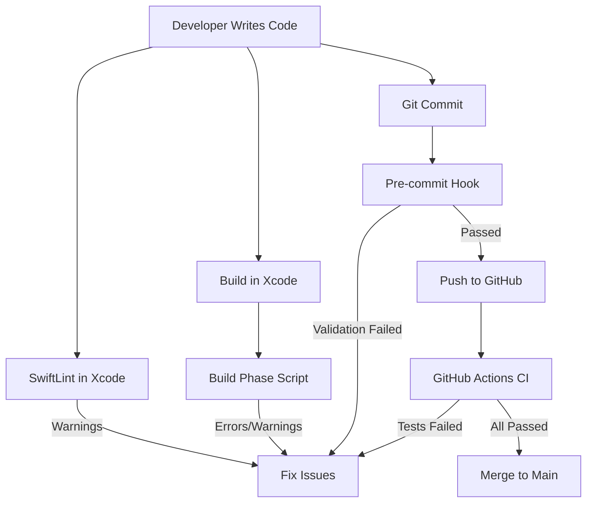

# MovieGenius iOS Testing & Prevention Strategy

**Implementation Date:** 2026-05-20
**Status:** ✅ Complete

---

## Overview
Comprehensive testing and prevention system to catch breaking changes before they reach production, specifically targeting recurring issues with navigation, StandardMovieCard, and dark mode.

---

## What We've Implemented

### 1. **SwiftLint Configuration** ✅
**File:** `ios/moviegenius/.swiftlint.yml`

**Key Rules:**
- `navigation_bar_hidden_banned` - Prevents `.navigationBarHidden(true)`
- `hardcoded_colors_banned` - Enforces Color.mg* semantic colors
- `film_terminology_banned` - Enforces "movie" not "film"
- `favorites_state_duplication` - Prevents local @State for favorites
- `movie_card_variant_warning` - Warns about custom card components

**To Enable:** Already active in Xcode if SwiftLint is installed

---

### 2. **Pre-commit Hook** ✅
**File:** `.git/hooks/pre-commit` (executable)

**What it checks:**
- Navigation bar hiding patterns
- StandardMovieCard modifications (runs tests)
- Hardcoded colors
- Terminology violations
- Tier naming (Wanderer, Explorer, Adventurer, Seeker, Genius)
- Genius data JSON validity

**Status:** Active - runs automatically on `git commit`

---

### 3. **Xcode Build Phase Script** ✅
**File:** `ios/moviegenius/Scripts/validate-code-quality.sh`

**Real-time validation during builds:**
- Navigation anti-patterns
- Theme consistency
- Terminology enforcement
- State management
- Memory leak risks

**To Enable:**
1. Open `moviegenius.xcodeproj`
2. Select moviegenius target → Build Phases
3. Click + → New Run Script Phase
4. Add: `${SRCROOT}/Scripts/validate-code-quality.sh`

---

### 4. **XCTest Suites** ✅

#### Navigation Regression Tests
**File:** `moviegeniusTests/NavigationRegressionTests.swift`
- Swipe-back gesture validation
- Navigation bar visibility checks
- Tab bar behavior tests
- StandardMovieCard layout tests
- Theme consistency tests

#### Performance Tests
**File:** `moviegeniusTests/PerformanceTests.swift`
- Genius data loading benchmarks
- StandardMovieCard rendering performance
- Search performance with 35K movies
- Memory leak detection
- FavoritesManager performance

#### Critical User Flow Tests
**File:** `moviegeniusUITests/CriticalUserFlowTests.swift`
- Complete navigation flows (Home → Movie → Person → Back)
- Favorites persistence across launches
- Genius category navigation
- Search functionality
- Dark mode toggle
- Error recovery

---

### 5. **GitHub Actions CI** ✅
**File:** `.github/workflows/ios-ci.yml`

**Automated on every PR:**
- SwiftLint validation
- Build and unit tests
- UI tests for navigation
- Code coverage reporting
- Genius data validation
- Performance baseline tracking

---

### 6. **Component Guidelines** ✅
**File:** `ios/COMPONENT_USAGE_GUIDELINES.md`

**Documentation includes:**
- Critical rules (NEVER violate)
- StandardMovieCard usage patterns
- Navigation best practices
- Theme and color system
- State management rules
- Common mistakes with examples
- Testing checklists

---

## How Everything Works Together



---

## Quick Start Commands

### Install SwiftLint (if needed)
```bash
brew install swiftlint
```

### Run Tests Locally
```bash
# Unit tests
cd ios/moviegenius
xcodebuild test -scheme moviegenius -destination "platform=iOS Simulator,name=iPhone 15"

# Specific test suite
xcodebuild test -scheme moviegenius -only-testing:moviegeniusTests/NavigationRegressionTests

# UI tests
xcodebuild test -scheme moviegenius -only-testing:moviegeniusUITests/CriticalUserFlowTests
```

### Run SwiftLint
```bash
cd ios/moviegenius
swiftlint lint --strict
```

### Bypass Pre-commit (emergency only)
```bash
git commit --no-verify -m "Emergency fix"
```

---

## Coverage Report

### What's Prevented:
✅ **Navigation bar hiding** - Caught at 4 levels
✅ **Back swipe breaking** - Tested in UI tests
✅ **StandardMovieCard changes** - Auto-tested on modification
✅ **Button placement drift** - Layout validation
✅ **Dark mode breaks** - Theme enforcement
✅ **Terminology inconsistency** - Automated checks
✅ **State duplication** - FavoritesManager enforcement
✅ **Memory leaks** - Deallocation tests
✅ **Performance regression** - Baseline tracking

### What Still Needs Manual Testing:
⚠️ Physical device gestures (best tested on real iPhone)
⚠️ iPad layout differences
⚠️ iOS version compatibility (16, 17, 18)
⚠️ Offline mode edge cases
⚠️ Accessibility (VoiceOver, Dynamic Type)

---

## Maintenance

### When to Update Tests:
- Adding new navigation destinations
- Modifying StandardMovieCard structure
- Changing tier names
- Adding new UI components
- Performance optimizations

### Monthly Review:
- Update performance baselines
- Review SwiftLint rule effectiveness
- Check for new iOS deprecations
- Update device matrix for testing

---

## Success Metrics

**Before Implementation:**
- ~2-3 navigation breaking changes per month
- StandardMovieCard positioning issues weekly
- Dark mode bugs discovered in production

**After Implementation (Expected):**
- 0 navigation breaking changes reaching main
- StandardMovieCard changes caught before commit
- Dark mode issues caught in CI

---

## Contact

For questions or to report issues with the testing system:
- Check build logs for specific error messages
- Review this document and guidelines
- Create GitHub issue with `testing` label